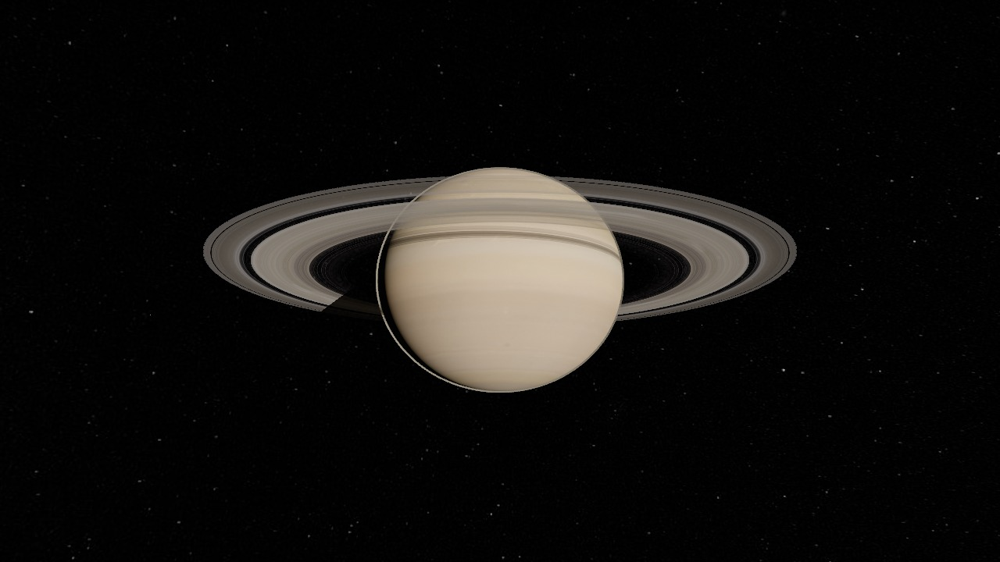
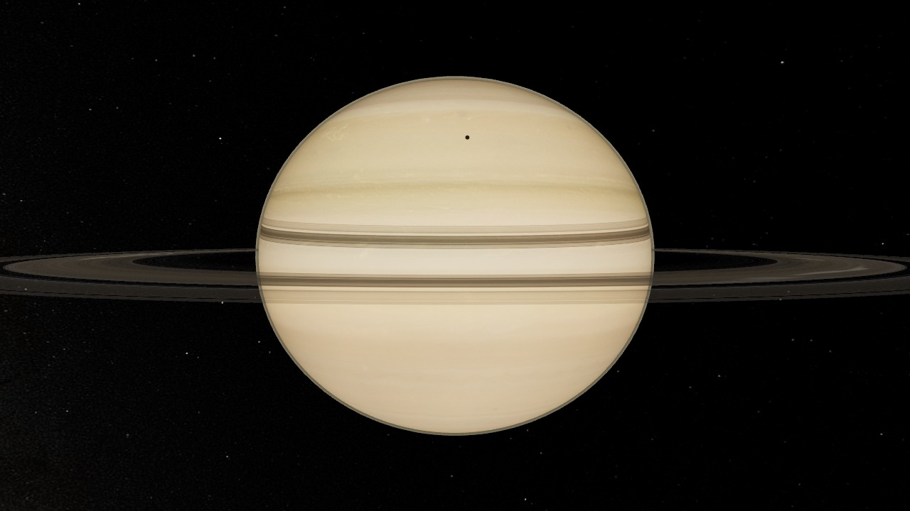

# Saturn — Real-time System Simulation

A real-time, scientifically-grounded simulation of Saturn, its rings and its
eight major moons, running in the browser on **WebGPU** (with automatic
WebGL2 fallback) via Three.js + TSL node materials.




  

**Live: [fgferre.github.io/Saturn](https://fgferre.github.io/Saturn/)**

## Running

```bash
npm install
npm run dev      # dev server
npm run build    # type-check + production build
npm run check    # orbital-math self-test (pure Node, no browser)
npm run deploy   # build + push dist to the gh-pages branch (GitHub Pages)
```

Append `?webgl` to the URL to force the WebGL2 backend.

## What's simulated

- **Orbits**: Keplerian mean elements (NASA/JPL SSD) for Mimas, Enceladus,
  Tethys, Dione, Rhea, Titan, Hyperion and Iapetus, propagated from the J2000
  epoch by Julian date. Runs at any time scale from real-time to days/second,
  forward from any date.
- **Sun & seasons**: the Sun's direction is computed from Saturn's
  heliocentric orbit + IAU pole orientation, so lighting, seasons and the
  ring-shadow geometry are correct for the simulated date.
- **Rings**: radial structure generated from Cassini/PDS region radii
  (D/C/B/Cassini Division/A/F, Encke & Keeler gaps, Maxwell ringlet) with a
  custom light-transport shader: lit/unlit faces, transmission, forward
  scattering when backlit, opposition surge, and the planet's oblate shadow.
- **Saturn**: procedural banded atmosphere, oblateness (Req 60,268 km /
  Rpol 54,364 km), System III rotation, north-polar hue, limb glow, and the
  rings' shadow projected onto the globe from the same ring-density profile.
- **Moons**: tidally-locked rotation; real Cassini global mosaics with
  grazing-light bump relief (procedural fallbacks preserved) — Herschel
  crater (Mimas), tiger stripes + water plumes (Enceladus), Ithaca Chasma &
  Odysseus (Tethys), wispy terrain (Dione), the two-tone dichotomy
  (Iapetus), sponge texture + chaotic tumble (Hyperion), and Titan's orange
  haze with a detached blue upper layer.
- **Eclipses & transits, fully emergent**: moon shadows sweep across the
  globe and rings (with sun-angular-size penumbra); moons entering Saturn's
  umbra go dark — lit only by *saturnshine* — and dim under ring shadows.
  Seasonally accurate: Titan shadow transits ceased after the 2025 equinox,
  while inner-moon transits still occur, exactly as in the simulation.
- **Ringshine**: Saturn's night side is lit by its rings — a per-frame
  latitude LUT integrated from the real ring brightness profiles.
- **Raymarched atmospheres**: single-scattering integral (TSL loops) for
  Saturn's limb/terminator and Titan's haze — the orange limb and blue
  upper fringe emerge from chromatic Mie + Rayleigh, not painted shells.
- **Real moon topography**: Gaskell SPC shape models (Mimas, Tethys), the
  Schenk & McKinnon 2024 global DEM (Enceladus) and the Weirich 2025 DTM
  (Dione) baked to displacement + normal maps — real crater rims on the
  limb. Rhea and Iapetus have no public DTM: their relief is procedural
  (documented), including Iapetus' real ~13 km equatorial ridge as a
  modeled feature. Surfaces shade with a Hapke-style BRDF
  (Lommel-Seeliger × opposition surge) — the chalky full-phase look.
- **GPU particles**: Enceladus' plumes are ballistic compute particles
  (up to 1M on Ultra; transform-feedback fallback on WebGL2) feeding a
  forward-scattering E ring; a volumetric particle slab fades in for ring
  fly-throughs, with self-gravity wakes, azimuthal grain, a kinked clumpy
  F ring and B-ring spokes on the main rings.
- **Cinematic pipeline**: HDR sun (radiance ≫1) driving physical bloom,
  anamorphic streak and lens ghosts gated by real sun occlusion; AgX tone
  mapping (calibrated against Cassini natural color), DOF focused on the
  tracked body (hyperfocal at planetary distances), subtle chromatic
  aberration, vignette and film grain; Cinema mode with a timed tour.
- **Quality presets**: Low / Med / High / Ultra (DPR, MSAA, raymarch steps,
  particle counts, tessellation, lens effects) with a one-shot fps
  auto-tuner.

## Controls

- **Drag / wheel** — orbit & zoom (damped)
- **Body list / labels** — click to fly the camera to any body (it stays
  glued to the moving body afterwards)
- **Time bar** — pause, speed presets (1× to 5 d/s), jump to *Now*
- **Toggles** — orbit lines, labels

## Architecture

```
src/
  orbital/     Pure Keplerian math + body type definitions. Zero rendering
               dependencies — this is the module a future full Solar System
               simulator reuses as-is (kepler.selfcheck.ts guards it).
  data/        Saturn-system tables (JPL SSD / Cassini PDS) and the
               Sun-direction ephemeris. Adding a planet system = adding a
               data module with the same shape.
  core/        Engine (WebGPURenderer + bloom PostProcessing + headless
               capture for QA) and the simulation clock (Julian date).
  materials/   TSL node materials: procedural Saturn bands + ring shadow,
               ring light transport, per-moon surfaces, atmosphere shells.
               Compiled to WGSL or GLSL automatically by three.
  effects/     GPU-animated particle effects (Enceladus plumes).
  scene/       Scene-graph assembly: SaturnSystem (bodies + orbits from the
               data tables), starfield, sun.
  camera/      FocusControls — OrbitControls wrapper with body tracking and
               smooth focus transitions.
  ui/          Vanilla-DOM HUD (time controls, body list, info panel) and
               projected body labels with Saturn occlusion.
```

**Scene conventions** (kept stable for future integration):
1 unit = 1000 km · Y = Saturn's north pole · moons orbit in Saturn's
equatorial frame · the primary body sits at the local origin. A Solar System
integrator would instantiate one such system per planet and parent them to
heliocentric anchors — the orbital module already supports any parent frame.

## Data sources & imagery credits

- Satellite mean elements & physical parameters: [JPL SSD](https://ssd.jpl.nasa.gov/sats/elem/)
- Ring region radii: Cassini / [PDS Ring-Moon Systems Node](https://pds-rings.seti.org/)
- Saturn pole orientation: IAU WGCCRE reports
- **Saturn globe map**: [Solar System Scope](https://www.solarsystemscope.com/textures/)
  (INOVE CZ), CC BY 4.0 — graded in-shader toward Cassini natural color
- **Ring radial profiles** (color, transparency, backscattered /
  forward-scattered / unlit-side brightness): Björn Jónsson's ring model
  (Voyager PPS + Cassini via the PDS Rings Node), 13,177 samples at 5 km —
  baked into runtime binaries by `scripts/bake-rings.mjs`
- **Moon global mosaics**: NASA/JPL-Caltech/Space Science Institute/Lunar and
  Planetary Institute (Paul Schenk's Cassini color mosaics, PIA18434–18439,
  public domain), color-graded from IR/UV-enhanced toward natural color
- **Star map**: NASA/GSFC Scientific Visualization Studio "Deep Star Maps
  2020"; star data Gaia DR2 (ESA/Gaia/DPAC) — oriented to the real celestial
  sphere as seen from Saturn
- **Moon topography**: Gaskell SPC shape models V2.0/V1.0 (Mimas, Tethys —
  NASA PDS); Enceladus global DEM 200 m (Schenk & McKinnon 2024, USGS
  Astropedia — cite Icarus 408, 115827); Dione SPC DTM (Weirich et al.
  2025, PDS SBN). Baked by `scripts/bake-moon-relief.mjs`. Rhea and
  Iapetus topography is **synthetic** (no public DTM exists as of 2026)
- Color calibration reference: Cassini natural-color photographs
  (PIA21345, PIA06175)
- Every texture is optional: if a file under `public/textures/` is missing,
  that body falls back to a fully procedural look.

## Known simplifications

- Node/apsidal precession of moon orbits is neglected (mean elements only).
- Moons do not eclipse each other and receive no ring shadows.
- Hyperion's chaotic tumble is a visual approximation, not an integration.
- The E ring and shepherd moonlets are not rendered.
